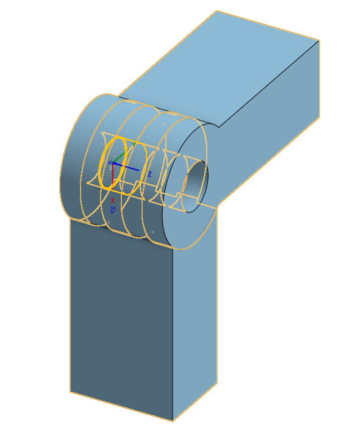

# OpenHand
A fully 3D printable open source mechatronic (biomimetic) hand.

 
## Version three (11/09/2020)
After a long hiatus, I came back to this design with some fresh eyes and ideas. Version 2 is completely scrapped as it is too impractical.  
For version 3 I've set out to make a better, more structuarally sound joint ideally with a better ROM too.
  
  
  

## V2 Assembly

  
  

## Dev log: 

### 07/06/202 Finger Version 2.1.4 
Will probably scrap Version 2.1.4 and go back to the drawing board.  
Current design has a number of fundamental issue that will need to be addressed before progressing:  

- The current design uses no external parts. This means that the hinge mechanism for the joints is between purely 3D printed parts  
this was initially fixed with an increased tolerance between hinge and hole, but it can be observed that this will wear down considerably fast with regular use.  

- As a result of being a purely 3D printed design, the current finger design is also to bulky and features limited ROM.

- The desing lacks any real method of actuation. Initially there was rails implemented for the use of fishing wire attached to a servo motor.  
But this design proved too problematic to print, with the supports filling up the hole and requiring a drill to remove. This on it's own is not a deal breaker,   
the design is supposed to be easy to assemble at home with limited technical skills and money. The required use of a drill is a reasoanble expectation as they are frequent in houeseholds.  
The main issue is that the current 'tendon rails' are far too bulky and could interfere with the function of the hand considerably.

After watching a youtube video on a similar project, I've decided to experiment with the use of metal wire in construction of the hand and as a possible hinge mechanism.  
I think for the redesign I will use a layered type design. So instead of whole discrete parts for the different functional sections of the hand I will design the sections of the hand out of multiple parts stacked on top of each other - in layers.  
